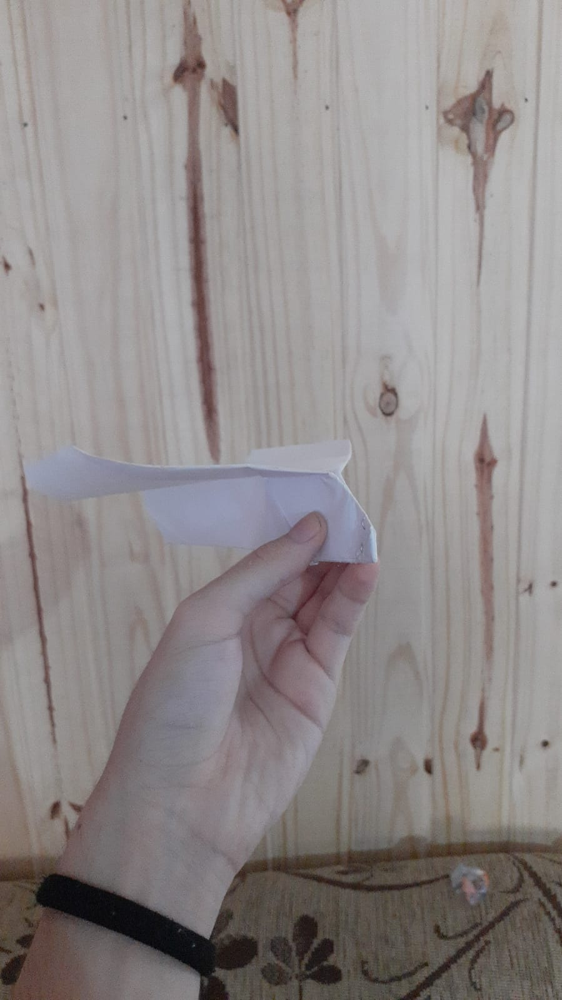
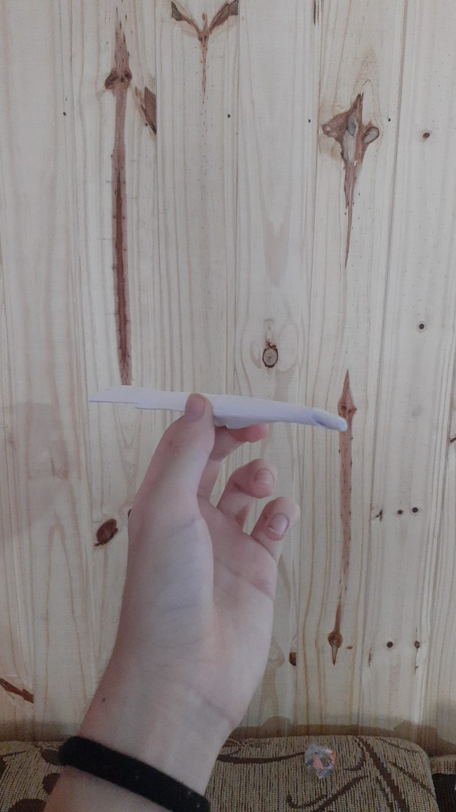
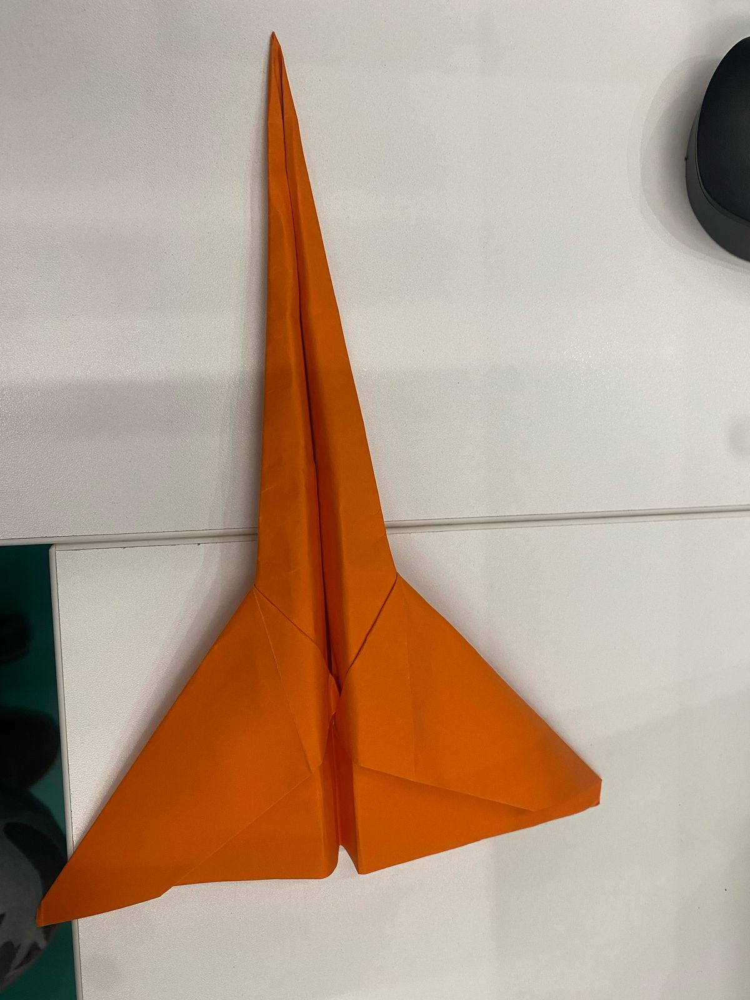

# 📊 Day 2 Testing Report

  <h2>Comparação entre Modelos</h2>
  
  

    

      
      
<i>Modelo P1 - Primeiro design desenvolvido</i>

    

    

      
      
<i>Modelo P2 - Segundo design, completamente diferente</i>

    

     

      
      
<i>Modelo Delta - Terçeiro design, Feito com folha colorida</i>

    

  

  <h3>Testes Comparativos</h3>
  

    

      <video width="320" height="240" controls>
        <source src="../p1video.mp4" type="video/mp4">
        Seu navegador não suporta o elemento de vídeo.
      </video>
      
<i>Teste do Modelo P1 - Design original</i>

    

    

      <video width="320" height="240" controls>
        <source src="../p2video.mp4" type="video/mp4">
        Seu navegador não suporta o elemento de vídeo.
      </video>
      
<i>Teste do Modelo P2 - Novo design</i>

    

  

## 🎯 1. Overview

No segundo dia de testes, focamos no desenvolvimento e avaliação de diferentes modelos de aviões de papel, com ênfase especial em designs para voo de longa distância e estética. O objetivo principal era identificar o modelo mais promissor para a competição.

### 📈 Métricas Iniciais
- Temperatura ambiente: 22°C
- Umidade relativa: 65%
- Vento: 2 km/h (condições ideais)

## ✈️ 2. Modelos Testados

### Modelo P1 🏆
- **Especificações Técnicas:**
  - Envergadura: 20cm
  - Peso: 4.5g
  - Ângulo de ataque: 12°
  - Material: Papel A4 80g/m²

### Modelo P2 🚀
- **Especificações Técnicas:**
  - Envergadura: 18cm
  - Peso: 4.2g
  - Ângulo de ataque: 15°
  - Material: Papel A4 80g/m²

### Modelo Delta 🚀 (Descartado)
- **Especificações Técnicas:**
   - Envergadura: 24cm
   - Peso: 5.1g
   - Ângulo de Ataque: 18°
   - Material: Folha colorida laranja A4 80g/m² + reforço com fita nas asas

### Modelo Canard 🚀 (Descartado)
- **Especificações Técnicas:**   
    - Envergadura: 16cm
    - Peso: 5.8g
    - Ângulo de Ataque: 25°
    - Material: Papel A4 80g/m² + reforço com fita na ponta

### Modelo Dart 🚀 (Descartado)
- **Especificações Técnicas:**
    - Envergadura: 22cm
    - Peso: 6.3g
    - Ângulo de Ataque: 26°
    - Material: Folha colorida verde A4 80g/m²

## 📊 3. Resultados e Análise

### Desempenho Comparativo

| Modelo | Distância (m) | Estabilidade | Tempo de Voo (s) |
|--------|---------------|--------------|------------------|
| P1     | 22.5          | ⭐⭐⭐⭐⭐    | 3.2              |
| P2     | 23.8          | ⭐⭐⭐⭐     | 3.5              |
| Delta  | 15.2          | ⭐⭐         | 2.1              |
| Canard | 12.8          | ⭐           | 1.8              |
| Dart   | 18.3          | ⭐⭐⭐       | 2.5              |

### Análise Detalhada

#### Modelo P1
- **Pontos Fortes:**
  - Excelente estabilidade em voo
  - Trajetória previsível
  - Fácil de lançar
- **Pontos de Melhoria:**
  - Menor alcance que o P2
  - Sensível a ventos laterais

#### Modelo P2
- **Pontos Fortes:**
  - Maior alcance
  - Melhor performance em ventos leves
  - Design inovador
- **Pontos de Melhoria:**
  - Requer técnica de lançamento específica
  - Menos estável que o P1

#### Modelo Delta (Descartado)
- **Pontos Fortes:**
    - Design
- **Pontos de Melhoria:**
    - Simplificação do design
    - Melhoria nas asas

#### Modelo Canard (Descartado)
- **Pontos Fortes:** 
    - A aceleração incial do Canard foi maior que a do modelo P2
- **Pontos de Melhoria:**
    - Distribuição de peso desbalanceada, causando um voo turbulhento
    - Uma asa maior que a outra

#### Modelo Dart (Descartado)
- **Pontos Fortes:** 
    - Voo bastante linear
    - Incialmente foi mais alto que todos os modelos
- **Pontos de Melhoria:**
    - Muito frágil
    - Ficou inutilizável com poucos testes

## 🎯 4. Conclusões

Após extensiva avaliação, os modelos P1 e P2 emergiram como as melhores opções, apresentando:

### Vantagens Comparativas
- Melhor estabilidade em voo
- Maior alcance
- Características aerodinâmicas superiores
- Consistência nos resultados

### Descobertas Importantes
1. O peso ideal para performance está entre 4.2g e 4.5g
2. Ângulos de ataque entre 12° e 15° proporcionam melhor desempenho
3. A envergadura ideal varia entre 18cm e 20cm

## 📈 5. Próximos Passos

### Prioridades Imediatas
- 🔄 Refinamento dos modelos P1 e P2
- 📊 Análise detalhada das características específicas
- 🎯 Desenvolvimento de técnicas de lançamento otimizadas

### Plano de Ação
1. Testar variações de peso nos modelos selecionados
2. Experimentar diferentes ângulos de ataque
3. Desenvolver técnicas de lançamento específicas para cada modelo

  
  
<i>Modelo P2 em voo durante os testes</i>

 
